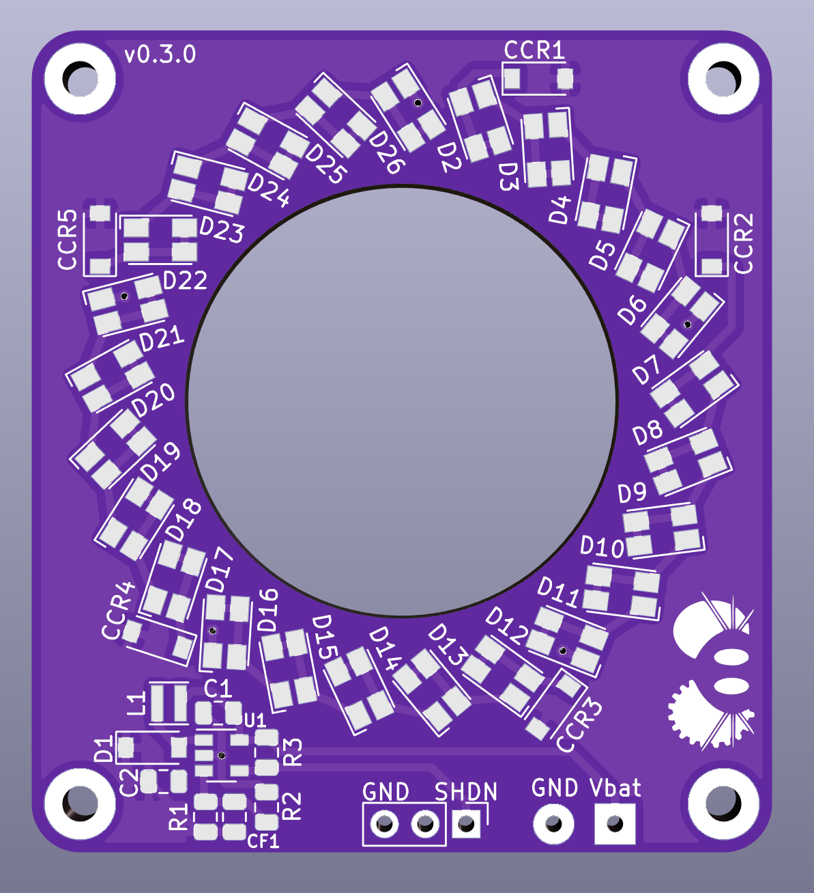

# LED Ring

A bright voltage regulated LED ring for vision tracking in FRC.

Copyright Franklin Harding 2020.

This source describes Open Hardware and is licensed under the CERN-OHL-Pv2

You may redistribute and modify this documentation and make products using it under the terms of the CERN-OHL-P v2 (https:/cern.ch/cern-ohl).This documentation is distributed WITHOUT ANY EXPRESS OR IMPLIED WARRANTY, INCLUDING OF MERCHANTABILITY, SATISFACTORY QUALITY AND FITNESS FOR A PARTICULAR PURPOSE. Please see the CERN-OHL-P v2 for applicable conditions

